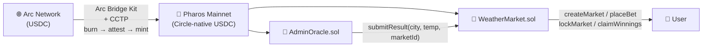

# Pharos Weather Market

[](https://github.com/pplmaverick/pharos-weather-market/actions/workflows/ci.yml)


Cross-chain prediction market infrastructure on Pharos | Weather as first use case | Arc Bridge Kit + CCTP | Circle-native USDC | no wrapped tokens
**Deployed on Pharos (Pacific Ocean)**

| Network | Contract Address |
|---|---|
| Pharos Mainnet (1672) | `0xcac5b9d2817325e78090e3ce4b9c299c819cf953` |
| Pharos Atlantic Testnet (688689) | `0x072a3a0c04cf8cdcaf5b4a73a4ed4ff5a841531f` |

---

## Why Pharos-Native

This project is not ported from another chain. Every design decision maps to a Pharos-specific capability.

| Problem | Generic EVM approach | Pharos-native approach |
|---|---|---|
| Cross-chain USDC onboarding | Wrapped tokens / third-party bridges | Arc Bridge Kit + CCTP: native burn-and-mint, no wrapped assets |
| Oracle dependency | External oracle required | Owner-submitted results; Phase 2 upgrades to Chainlink CCIP |
| Settlement finality | 10–60s confirmation | Sub-second finality, 30,000 TPS parallel execution |
| RWA-grade stablecoin | Any ERC-20 | Circle-native USDC, part of Pharos RealFi ecosystem |

---

## Architecture



---

## Core Features

### Arc Bridge Kit + CCTP Cross-chain Onboarding

Users hold USDC on Arc and move it to Pharos via Arc Bridge Kit, which uses Circle's Cross-Chain Transfer Protocol (CCTP) for native burn-and-mint. The asset that arrives in the Pharos wallet is Circle-native USDC — not a synthetic wrapper — and is the same asset accepted by WeatherMarket with no extra approval step.

### Multi-Bucket Temperature Prediction

Markets define temperature ranges as an ascending array of upper bounds. Given `buckets = [20, 25, 30, 35]`, five prediction ranges are created. Up to 253 buckets per market. The structure scales to any granularity without changing the contract interface.

### No-Winner Full Refund

When no bets land on the winning bucket, the 2% protocol fee is waived and all USDC is refunded at face value. The market's `noWinner` flag triggers this path automatically on-chain — no manual intervention required.

### 2% Protocol Fee

`FEE_BPS = 200`. The fee is collected only when at least one winning bet exists, deducted from the total pool before proportional payout, and accumulated in `collectedFees` for owner withdrawal via `withdrawFees()`.

---

## Deployed Contracts

**Pharos Atlantic Testnet (Chain ID: 688689)**

| Contract | Address |
|---|---|
| WeatherMarket | [`0x072a3a0c04cf8cdcaf5b4a73a4ed4ff5a841531f`](https://atlantic.pharosscan.xyz/address/0x072a3a0c04cf8cdcaf5b4a73a4ed4ff5a841531f) |
| AdminOracle | [`0xcac5b9d2817325e78090e3ce4b9c299c819cf953`](https://atlantic.pharosscan.xyz/address/0xcac5b9d2817325e78090e3ce4b9c299c819cf953) |
| USDC (testnet) | `0xcfc8330f4bcab529c625d12781b1c19466a9fc8b` |

**Pharos Pacific Ocean Mainnet (Chain ID: 1672)**

| Contract | Address |
|---|---|
| WeatherMarket | [`0xcac5b9d2817325e78090e3ce4b9c299c819cf953`](https://pharosscan.xyz/address/0xcac5b9d2817325e78090e3ce4b9c299c819cf953) |
| AdminOracle | [`0xbdc53e50b1167ce1199bfad54a034f7ab1741051`](https://pharosscan.xyz/address/0xbdc53e50b1167ce1199bfad54a034f7ab1741051) |
| USDC | `0xC879C018dB60520F4355C26eD1a6D572cdAC1815` |
| CCIPWeatherOracle | [`0x914c40a644493b47336de847b0404e729e06c68d`](https://pharosscan.xyz/address/0x914c40a644493b47336de847b0404e729e06c68d) |

### Chainlink CCIP Oracle

| Item | Value |
|---|---|
| CCIPWeatherOracle | `0x914c40a644493b47336de847b0404e729e06c68d` |
| CCIP Router (Pharos) | `0x4e52dD94e9BCfeFE3C78153bDfB0AB1d30687297` |
| Chain Selector | `7801139999541420232` |
| Supported Source Chains | Ethereum, Base, Polygon, Jovay |
| Message Format | `abi.encode(uint256 marketId, int256 finalTemp)` |

---

## Quick Start

**Prerequisites**
- Node.js 18+
- A funded Pharos wallet (PROS for gas, USDC for betting)
- Arc Bridge Kit or direct faucet USDC for testnet

```bash
# 1. Install dependencies
npm install

# 2. Configure environment
cp .env.example .env
```

| Variable | Description |
|---|---|
| `PRIVATE_KEY` | Deployer wallet private key (no `0x` prefix) |
| `PHAROS_USDC_ADDRESS` | USDC contract address on Pharos |

```bash
# 3. Compile
npx hardhat compile

# 4. Run tests
npx hardhat test

# 5. Deploy to Pharos Atlantic Testnet
npx hardhat run scripts/deploy-pharos.ts --network pharos

# 6. Deploy to Pharos Mainnet
npx hardhat run scripts/deploy-pharos-mainnet.ts --network pharosMainnet
```

### Deployed Logs

<details>
<summary>Pharos Atlantic Testnet — deployment transcript</summary>

```
Deploying with: 0xed2B5717c9b936ecC76d75401026A99143e278F5

[1/3] Deploying WeatherMarket...
  tx: 0x44442849b444daa6aa58f03cf7a6d3abf828ccae06e5207ae43a4efc61ddad7c
  WeatherMarket deployed: 0x072a3a0c04cf8cdcaf5b4a73a4ed4ff5a841531f

[2/3] Deploying AdminOracle...
  tx: 0x49f4fc15e0ed1d94c1262da7f90f5125dd4356698806446dc4af909ab8411502
  AdminOracle deployed: 0xcac5b9d2817325e78090e3ce4b9c299c819cf953

[3/3] Setting oracle on WeatherMarket...
  oracle updated: 0xa9a298b3354dfd4efe0f7215ecfb7a89547aaf45d9351953a59133efb69db144

✓ Deployment complete
```

</details>

<details>
<summary>Pharos Pacific Ocean Mainnet — deployment transcript</summary>

```
Deploying with: 0xed2B5717c9b936ecC76d75401026A99143e278F5

[1/3] Deploying WeatherMarket...
  tx: 0xcf4fc0e899c87cb98b3536ba162bfa7bff4833433bddba10d13fa0cff0725afa
  WeatherMarket deployed: 0xcac5b9d2817325e78090e3ce4b9c299c819cf953
  Gas used: 3,474,987

[2/3] Deploying AdminOracle...
  tx: 0x1bf2ac094ff1008c3794de794289829add224c3bf2944fb43bb6049fd197c582
  AdminOracle deployed: 0xbdc53e50b1167ce1199bfad54a034f7ab1741051

[3/3] Setting oracle on WeatherMarket...
  oracle updated: 0x6803c27bcdd989baebd8c21f6b30d6b256517e082138188306a967a6c7e45291

✓ Deployment complete
```

</details>

### Settlement Records

**Pharos Pacific Ocean Mainnet — Round 2 (2026-06-24)**

| Market | City | Final Temp | Buckets | Winning Bucket | noWinner | Status |
|---|---|---|---|---|---|---|
| #4 | Taipei | 29°C | [30,33,36,39] | 0 (< 30°C) | true | SETTLED |
| #5 | Tokyo | 23°C | [20,23,26,29] | 1 (20–23°C) | true | SETTLED |
| #7 | Seoul | 24°C | [24,27,30,33] | 0 (≤ 24°C) | true | SETTLED |
| #8 | Bangkok | 32°C | [29,32,35,38] | 1 (29–32°C) | true | SETTLED |

> Note: marketId #6 is a duplicate Seoul (RPC timeout on first attempt; tx landed on-chain). Excluded from frontend.

**Pharos Pacific Ocean Mainnet — Round 1 (2026-06-16)**

| Market | City | Final Temp | Winning Bucket | Status |
|---|---|---|---|---|
| #0 | Hong Kong | 26°C | 1 | SETTLED |
| #1 | Shanghai | 28°C | 2 | SETTLED |
| #2 | Chicago | 19°C | 1 | SETTLED |
| #3 | London | 16°C | 1 | SETTLED |

---

## Contract Interface

```solidity
// WeatherMarket
createMarket(string city, uint256 targetDate, int256[] buckets, uint256 lockTime)
    returns (uint256 marketId)                              // onlyOwner

placeBet(uint256 marketId, uint8 bucket, uint256 amount)   // requires prior USDC approval

lockMarket(uint256 marketId)                               // callable by anyone after lockTime

claimWinnings(uint256 marketId)                            // ReentrancyGuard

withdrawFees()                                             // onlyOwner

getMarket(uint256 marketId)
    returns (city, targetDate, lockTime, status,
             totalPool, finalTemp, winningBucket, buckets, noWinner)

// AdminOracle
submitResult(string city, int256 temp, uint256 marketId)   // onlyOwner
setWeatherMarket(address _weatherMarket)                   // onlyOwner
```

---

## Temperature Encoding & Bucket System

Temperatures are stored as `int256` with whole-integer degree Celsius precision:

```
submitResult("Taipei", 28, 0)
// 28°C evaluated against buckets [20, 25, 30, 35]
// 28 ≤ 30 → winning bucket = 2
```

Bucket boundaries use the same encoding. Given `buckets = [20, 25, 30, 35]`:

| Bucket | Range |
|---|---|
| 0 | ≤ 20°C |
| 1 | > 20°C and ≤ 25°C |
| 2 | > 25°C and ≤ 30°C |
| 3 | > 30°C and ≤ 35°C |
| 4 | > 35°C |

Oracle rounding: raw float values from weather APIs should be floored before submission (e.g. 28.9°C → 28).

---

## Fees & Security

**Fees**
- Market fee: 2% of total pool (`FEE_BPS = 200`), deducted only when there is at least one winner
- No winner: all bets refunded in full, fee waived

**Security**
- `onlyOracle` modifier gates `WeatherMarket.submitResult`
- `onlyOwner` gates `createMarket`, `setOracle`, `withdrawFees`, and all `AdminOracle` functions
- `ReentrancyGuard` on `claimWinnings`
- Market state machine enforces strict progression: `OPEN → LOCKED → SETTLED`

---

## Implementation Notes

**Gas limit must be set explicitly**

Pharos testnet does not reliably auto-estimate gas for all transaction types. The stable configuration verified on Atlantic testnet:

```typescript
const GAS_OPTS = {
  gas: 1_000_000n,
  gasPrice: parseGwei("10"),
} as const;
// reservation per tx: 1,000,000 × 10 gwei = 0.01 PROS
```

Avoid `gas: 5_000_000n` combined with `maxFeePerGas: 50 gwei` — this reserves 0.25 PROS per transaction, which silently exhausts a typical funded testnet wallet.

**Silent revert on insufficient PROS balance**

When PROS balance falls below `gasLimit × gasPrice`, Pharos does not reject at the mempool level. The transaction is submitted, receives a receipt, and returns `status: "reverted"` with no revert reason or error message. Always check explicitly after every write:

```typescript
const receipt = await publicClient.waitForTransactionReceipt({ hash });
if (receipt.status === "reverted") {
  throw new Error(`tx reverted: ${hash}`);
}
```

**Mainnet gas consumption differs from testnet**

Pharos mainnet WeatherMarket deployment consumed 3,474,987 gas versus ~500,000 on Atlantic testnet. Use `gas: 5_000_000n` for mainnet deployments:

```typescript
const GAS_OPTS = {
  gas: 5_000_000n,
  gasPrice: parseGwei("10"),
} as const;
// mainnet reservation: 5,000,000 × 10 gwei = 0.05 PROS
```

**Arc Bridge Kit chain identifier for Pharos Testnet**

The correct SDK chain identifier is `"Pharos_Testnet"`, not `"Pharos_Atlantic"`. The viem adapter requires a separate package:

```bash
npm install @circle-fin/adapter-viem-v2
```

Use `createViemAdapterFromPrivateKey()`, not `createViemAdapter()`. Burn TX on Arc Testnet and Mint TX on Pharos Atlantic are separate transactions — track both hashes.

---

## Stack

| Layer | Technology |
|---|---|
| Smart contract | Solidity ^0.8.28, OpenZeppelin 5.x |
| Development | Hardhat 3 + Viem |
| Oracle | AdminOracle (owner-submitted); Phase 2: Chainlink CCIP |
| Cross-chain | Arc Bridge Kit + Circle CCTP |
| Testnet token | USDC `0xcfc8330f4bcab529c625d12781b1c19466a9fc8b` |
| Mainnet token | USDC `0xC879C018dB60520F4355C26eD1a6D572cdAC1815` |

---

## Roadmap

**✅ M1 — Testnet Deployment (completed)**
- WeatherMarket + AdminOracle deployed on Pharos Atlantic (Chain ID 688689)
- Full e2e flow verified on-chain: `createMarket → placeBet → lockMarket → submitResult → claimWinnings`
- 2% fee logic and no-winner refund path confirmed
- Silent revert behavior diagnosed; gas configuration stabilized

**✅ M2 — Mainnet + CCTP Bridge**
- Deploy to Pharos Pacific Ocean Mainnet (Chain ID 1672)
- Arc Bridge Kit frontend integration for USDC onboarding from Arc
- Multi-city support: Taipei, Tokyo, Bangkok, Seoul

**✅ M3 — Decentralized Oracle (completed)**
- CCIPWeatherOracle deployed on Pharos Mainnet: `0x914c40a644493b47336de847b0404e729e06c68d`
- Chainlink CCIP integration: accepts inbound messages from Ethereum, Base, Polygon, Jovay
- Allowlisted sender model: `setAllowedSender(sourceChainSelector, sender, true)` gates each lane
- Message format: `abi.encode(uint256 marketId, int256 finalTemp)` → auto-calls `WeatherMarket.submitResult`

---

## Developer

[](https://github.com/pplmaverick)
[](https://pharosscan.xyz/address/0xed2B5717c9b936ecC76d75401026A99143e278F5)

Wallet: [`0xed2B5717c9b936ecC76d75401026A99143e278F5`](https://pharosscan.xyz/address/0xed2B5717c9b936ecC76d75401026A99143e278F5)

## License

MIT

## Market History

### Round 1 (Mainnet)
| Market | City | Buckets (°C) | Result |
|--------|------|--------------|--------|
| #0 | Hong Kong | [25,28,31,34] | SETTLED (finalTemp: 26°C) |
| #1 | Shanghai | [20,24,28,32] | SETTLED (finalTemp: 28°C) |
| #2 | Chicago | [15,20,25,30] | SETTLED (finalTemp: 19°C) |
| #3 | London | [12,16,20,24] | SETTLED (finalTemp: 16°C) |

### Round 2 (Mainnet)
| Market | City | Buckets (°C) | Result |
|--------|------|--------------|--------|
| #4 | Taipei | [30,33,36,39] | SETTLED (finalTemp: 29°C) |
| #5 | Tokyo | [20,23,26,29] | SETTLED (finalTemp: 23°C) |
| #7 | Seoul | [24,27,30,33] | SETTLED (finalTemp: 24°C) |
| #8 | Bangkok | [29,32,35,38] | SETTLED (finalTemp: 32°C) |

### Round 3 (Mainnet)
| Market | City | Buckets (°C) | Status |
|--------|------|--------------|--------|
| #9 | Singapore | [28,31,34,37] | OPEN |
| #10 | Dubai | [35,38,41,44] | OPEN |
| #11 | Sydney | [10,13,16,19] | OPEN |
| #12 | Paris | [16,19,22,25] | OPEN |
